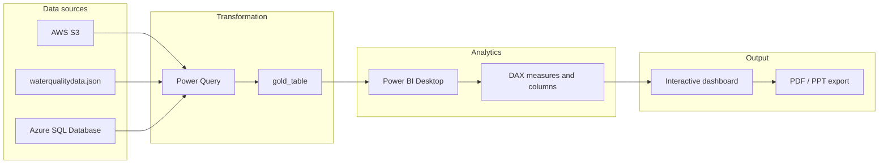

# Water Quality Analysis — Power BI Dashboard

## Dashboard screenshots

### Page 1 — Overview


### Page 2 — Detail view


## Summary

This project is an end-to-end business intelligence solution for **European water quality monitoring data**. Raw sensor and laboratory observations are ingested from cloud storage, refined into an analytical gold layer, and modeled in Power BI with **DAX** measures—including a custom **Water Quality Index (WQI)**. The result is an interactive **Water Quality Analysis** dashboard for exploring determinand concentrations, safety levels, and trends by country, year, water body, and matrix.

Stakeholders can filter across countries and reference years, compare normalized safety metrics against thresholds, and export insights for reporting and compliance review.

## Aim

- Turn large-scale water quality records into **actionable, visual insights** for environmental monitoring and policy support.
- Support **data-driven decisions** on water safety, trend detection, and cross-country comparison.
- Enable **regulatory and sustainability** use cases through clear KPIs, slicers, and exportable reports (PDF / PowerPoint).
- Demonstrate a production-style BI workflow: **ingest → clean → model → visualize → distribute**.

## Project architecture

The solution follows a layered pipeline from source systems to the published dashboard.



| Layer | Role |
|--------|------|
| **Ingestion** | Pull aggregated European water quality data from **AWS S3** and/or **Azure SQL Database**; local development can use bundled **JSON** and **CSV/XLS** files. |
| **Preparation** | Clean types, rename fields, and shape records into the **gold_table** schema (country, determinand, matrix, concentrations, sample quality flags, dates). |
| **Modeling** | Star-style model in Power BI; calculated columns and measures in **DAX** (min/max normalization, WQI). |
| **Presentation** | Multi-page report with KPI cards, slicers, bar/line/treemap visuals, and detail tables. |

### Dashboard capabilities

- **KPIs:** countries, determinands, water body types, and analyzed matrices.
- **Slicers:** country, reference year, determinand, water body category.
- **Visuals:** concentration by country, safety levels (WQI) with reference line, determinand trends over years, treemap by country and determinand, and tabular drill-downs.

## Repository structure

```
PowerBI Dashboard for Water Quality/
├── README.md
├── Code/
│   ├── WaterQuality_Dashboard.pbix   # Power BI report (data model + visuals)
│   ├── BI-DAX                        # DAX calculated columns and measures (source of truth)
│   ├── waterqualitydata.json         # Raw EIONET-style monitoring export (JSON)
│   ├── Dashboard - Page 1.png        # Main dashboard screenshot
│   ├── Dashboard - Page 2.png        # Detail / table view screenshot
│   └── AccessDatabaseEngine.exe      # Optional: Microsoft Access DB engine (Excel/legacy connectors on Windows)
└── Data/
    ├── gold_table.csv                # Curated analytical table (Power BI primary local source)
    ├── gold_table.xls                # Same dataset in Excel format
    ├── finance.json                  # Auxiliary sample data (optional)
    └── Financial Sample.csv / .xlsx  # Auxiliary sample data (optional)
```

### Data model (gold layer)

The **`gold_table`** dataset includes monitoring site, water body, determinand, matrix, units, reference year, sampling period, LOQ, sample counts, quality flags, and concentration statistics (minimum, mean, maximum, median), plus country and date range fields.

Example fields: `Country_Name`, `Determinand_Label`, `water_body`, `Analyzed_Matrix`, `Reference_Year`, `Mean_Value`, `Maximum_value`, `Median_Value`, `Num_of_Samples`, `Quality_Samples`.

### DAX analytics (`Code/BI-DAX`)

| Name | Type | Purpose |
|------|------|---------|
| `Minvalue Country` | Calculated column | Minimum mean value per country and determinand |
| `MaxValue Country` | Calculated column | Maximum mean value per country and determinand |
| `Normalized MeanValue bycountry` | Calculated column | Min–max normalization of mean values (0–1 scale) |
| `WQI` | Measure | Average normalized value by country (Water Quality Index) |

## Tools and technologies

| Category | Technology |
|----------|------------|
| BI & visualization | **Microsoft Power BI** (Desktop; optional **Power BI Service** for sharing) |
| Analytics language | **DAX** (Data Analysis Expressions) |
| ETL / shaping | **Power Query** (M) inside Power BI |
| Cloud data | **AWS S3**, **Azure SQL Database** |
| Database (enterprise path) | **Microsoft SQL Server** |
| Local formats | **JSON**, **CSV**, **Excel** (.xls / .xlsx) |
| Reporting output | PDF and PowerPoint export from Power BI |

## Prerequisites

- **Windows** or **macOS** with [Power BI Desktop](https://powerbi.microsoft.com/desktop/) installed.
- Sufficient disk space for `waterqualitydata.json` and the `.pbix` file (large JSON if using the full export).
- **Optional (Windows):** `Code/AccessDatabaseEngine.exe` if you connect via Excel/Access-based providers.
- **Optional (cloud):** Access to your **AWS S3** bucket and/or **Azure SQL** instance if the report is wired to live sources instead of local files.

## Installation and running the project

Power BI projects are opened and refreshed in Desktop rather than run from a CLI.

### 1. Get the repository

```bash
git clone <your-repo-url>
cd "PowerBI Dashboard for Water Quality"
```

### 2. Install Power BI Desktop

Download and install from the [official Power BI Desktop page](https://powerbi.microsoft.com/desktop/).

### 3. Open the dashboard

1. Launch **Power BI Desktop**.
2. Open `Code/WaterQuality_Dashboard.pbix`.

### 4. Configure data sources

If the report prompts for credentials or paths:

- **Local development:** point the `gold_table` query to `Data/gold_table.csv` or `Data/gold_table.xls`.
- **Raw JSON path:** set the connector to `Code/waterqualitydata.json` when building or refreshing from source.
- **Cloud:** update connection strings for **Azure SQL** and/or **AWS S3** to match your environment.

### 5. Apply or verify DAX

Calculated objects are documented in `Code/BI-DAX`. After model changes, recreate or paste measures/columns in Power BI’s **Model** view if they are not already embedded in the `.pbix`.

### 6. Refresh and explore

1. Select **Home → Refresh** to load the latest data.
2. Use slicers (country, year, determinand, water body) on **Page 1** and **Page 2**.
3. Publish to **Power BI Service** (optional) for web sharing and scheduled refresh.

### 7. Export reports

Use **File → Export to PDF** or **Export to PowerPoint** to share snapshots with stakeholders.

## Notes

- The bundled `Data/gold_table.csv` is a **curated subset** suitable for local refresh; the dashboard screenshots reflect the **full multi-country model** when connected to the complete dataset (cloud or full JSON pipeline).
- Re-import DAX from `Code/BI-DAX` whenever you rebuild the semantic model from scratch.

## License

Add your preferred license here if you publish this repository publicly.
